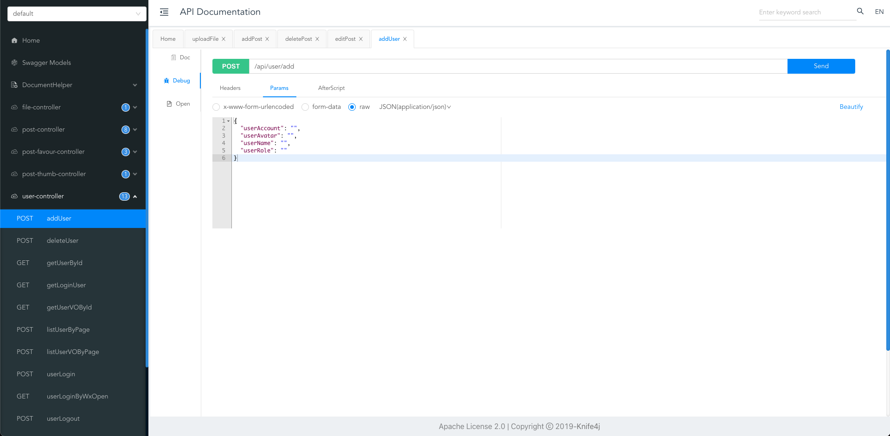

# SpringBoot Initial project template

This is a Java SpringBoot template for starting a new project that includes commonly used frameworks and example code 
for mainstream business. With this template, you can quickly set up the backend of a content website in just one minute. 
You can also use this as a foundation to develop your own project.

## Framework

### Framework & Characteristic

- Spring Boot 2.7.x
- Spring MVC
- MyBatis + MyBatis Plus
- Spring Boot
- Spring AOP
- Spring Scheduler
- Spring Transaction annotation

### Database

- MySQL 
- Redis 
- Elasticsearch 
- COS(Cloud Object Storage)

### Tool

- Easy Excel
- Hutool
- Gson
- Apache Commons Lang3
- Lombok

### Business characteristics

- Spring Session Redis(Distributed login)
- Global request response interceptor (logging)
- Global exception handler
- Custom error codes
- Encapsulation of common response classes
- Swagger + Knife4j API documentation
- Custom permission annotations + global validation
- Global cross-domain handling
- Resolving long integer precision loss
- Multiple environment configurations


## Business functions

- Provide example SQL (user, post, post like, post collection tables)
- User login, registration, logout, update, search, and permission management
- Post creation, deletion, editing, updating, database search, and flexible search using Elasticsearch
- Post liking and unliking
- Post collection, uncollection, and search for collected posts
- Full and incremental synchronization of posts with Elasticsearch using scheduled tasks
- Support for login via WeChat Open Platform
- Support for WeChat official account subscription, messaging, and menu settings
- Support for file uploads for different business domains

### Unit test

- JUnit5


## Quick start

> All places that need to be modified are marked with `todo`~

### MySQL Configuration

1）Modify the database configuration in `application.yml` to your own:

```yml
spring:
  datasource:
    driver-class-name: com.mysql.cj.jdbc.Driver
    url: jdbc:mysql://localhost:3306/my_db
    username: root
    password: 123456
```

2）Execute the database statements in `sql/create_table.sql` to automatically create the database tables

3）Start the project, visit http://localhost:8101/api/doc.html to open the API documentation. You can debug the APIs online without the need for frontend development~



### Redis Configuration

1）Modify the Redis Configuration in `application.yml` to your own:

```yml
spring:
  redis:
    database: 1
    host: localhost
    port: 6379
    timeout: 5000
    password: 123456
```

2）Modify session storage mode in `application.yml` to your own:

```yml
spring:
  session:
    store-type: redis
```

3）Remove exclude parameter from `@SpringBootApplication` annotation at the beginning of the `MainApplication` class:


Before modify：

```java
@SpringBootApplication(exclude = {RedisAutoConfiguration.class})
```

After modify：


```java
@SpringBootApplication
```

### Elasticsearch Search Engine

1）Modify the Elasticsearch Search Engine`application.yml` to your own:

```yml
spring:
  elasticsearch:
    uris: http://localhost:9200
    username: root
    password: 123456
```

2）Copy the contents of the `sql/post_es_mapping.json` file and create an index 
(equivalent to creating a database table) by calling Elasticsearch's API or Kibana Dev Tools.


```
PUT post_v1
{
 Parameters in sql/post_es_mapping.json 
}
```


3）Start the synchronization task to synchronize posts from the database to Elasticsearch.

Locate the `FullSyncPostToEs` and `IncSyncPostToEs` files in the job directory, 
uncomment the `@Component` annotation, and execute the program again to trigger the synchronization:

```java
// todo remove annotation
//@Component
```